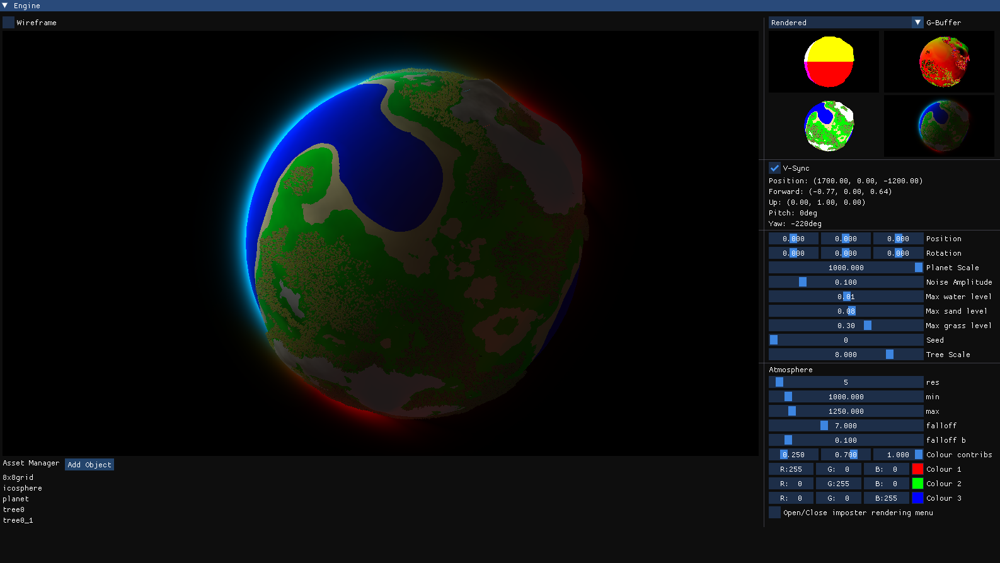

# PlanetRenderer
This repo is research for my upcoming scholarship project, intending get further understanding and experience in C++ and OpenGL.

## Features & screenshots

^ Above is an overview of the features I have, a planet with ~50k trees rendered in real time, volumetric atmospheric scattering (colours to be added), deffered rendering pipline for a solution to expensive overdraw, realtime planet generation (planet generation is procedural and happens via compute shaders for all components). Many settings making the planet dynamic. An asset manager for ease of adding meshes to the project.
   
Below shows the dyamic lod of the planet, tesselated based on distance on the gpu makes this extremely performant and low cost (frame time lost to planet generation is negligible)

    

        
    

    

        
    

  

    

        Rendering trees are a challenging task as they have lots of vertices & alpha textures, but my implementation allows me to render ~100k trees before noticing any dip in performance. This is because all trees are just an image, which is switched out based on your viewing angle to the billboard. The only name I've found for this is Simplygon's flipbook billboard imposters, and getting them to work was hell.
    

    

        
    

  

    

        
    

    

        Trees when close enough, swtich out with their full mesh version, and is indirectly drawn and managed all of the gpu via compute shaders and atomic counters. (Found a way to not use atomic counters but havn't implemented yet).
    

  

    

        For flipbook imposters, I've found it hard to do in blender as there has not been many implementations on it, so I made my own interface to create these "flipbook imposters" textures.
    

    

        
    

## Libraries
GLFW, GLEW, glm, ImGui, Assimp, and stb_image